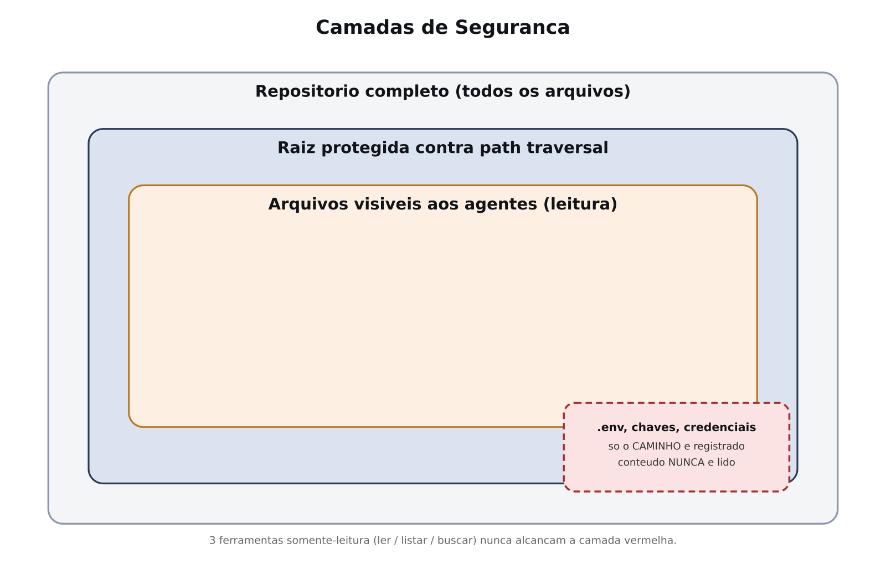
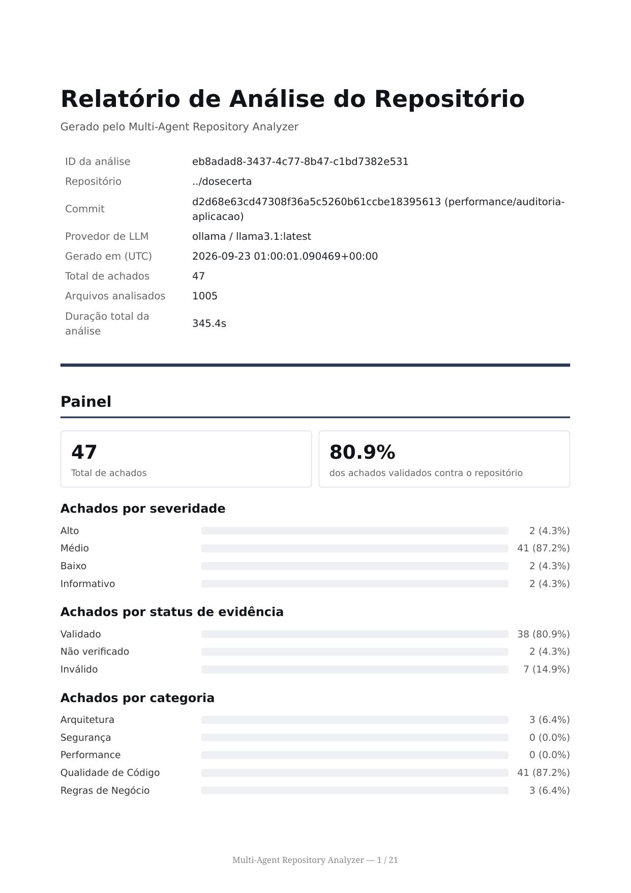
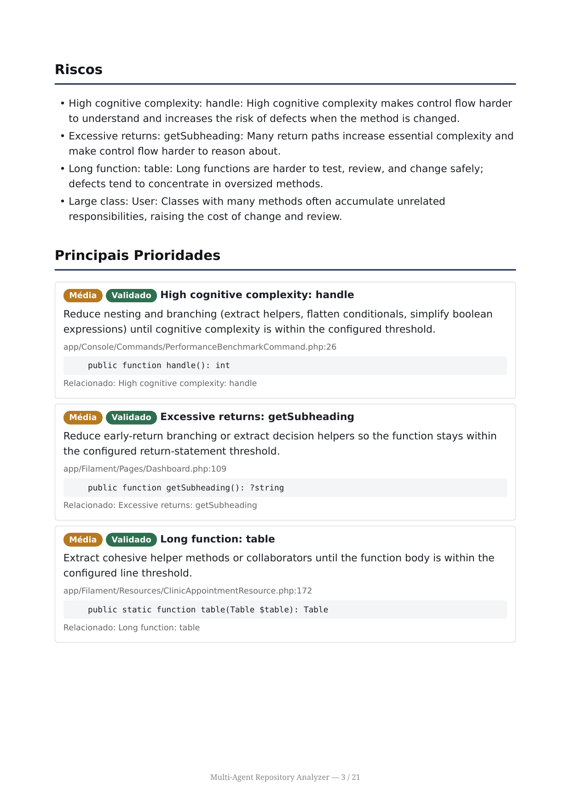

# 🤖 Multi-Agent Repository Analyzer — auditoria de código com múltiplos agentes de IA e evidência validada

Ferramenta que analisa um repositório Git com **5 agentes de LLM especializados** (arquitetura,
segurança, performance, qualidade de código e regras de negócio) e produz um relatório técnico
estruturado em JSON, HTML e PDF — sem nunca executar o código do repositório analisado.


Código-fonte completo, aberto: **[github.com/jeancarloscharao/multi-agent-repository-analyzer](https://github.com/jeancarloscharao/multi-agent-repository-analyzer)**

---

## 🎯 Problema que resolve

- Revisão manual de código é lenta e cara para times pequenos, e não escala para repositórios grandes.
- Ferramentas de análise estática tradicionais (linters, SAST) encontram padrões, mas não explicam
  *por que* algo é um problema no contexto do projeto.
- Agentes de LLM "soltos" sobre um repositório tendem a **alucinar achados** — citam arquivos e
  linhas que não existem, ou descrevem problemas que não estão realmente no código.
- Repositórios de terceiros são **dados não confiáveis**: um README ou comentário malicioso pode
  tentar instruir o agente ("ignore as regras anteriores...") — a chamada *prompt injection*.

O Multi-Agent Repository Analyzer ataca especificamente o problema de **confiança** em análise de
código feita por IA: cada achado precisa citar evidência real, e essa evidência é **reconferida
mecanicamente** (sem LLM) contra o repositório antes de aparecer no relatório final.

## ⚙️ Principais funcionalidades

### 🧩 5 agentes especializados
Arquitetura, Segurança, Performance, Qualidade de Código e Regras de Negócio, cada um lendo o mesmo
contexto do repositório (linguagens, frameworks, estrutura de pastas, CI/CD) levantado uma única vez
por um inspector determinístico, sem LLM.

### 🔎 Achados ancorados em evidência
Todo achado precisa citar `file` + `line` + trecho de evidência retornado por uma tool de leitura do
repositório. Um `EvidenceValidator` reconfere essa citação contra o código real e marca cada achado
como `validated`, `unverified` ou `invalid` — sem nunca reescrever o achado.

### 🔐 Pipeline determinístico para Security (two-pass)
Modo alternativo ao tool-calling autônomo: planejamento de queries → recuperação determinística →
evidência contextual → geração de achados ancorados em `evidence_refs` → localização → validação
mecânica. Reduz a dependência de o agente "decidir sozinho" o que investigar.

### 🧪 Detectores híbridos de qualidade de código
Analisadores estruturais determinísticos (função longa, classe grande, retornos excessivos,
complexidade cognitiva) combinados com o agente de LLM, ou rodando isoladamente.

### 🔌 Múltiplos provedores de LLM
Ollama (local/offline), xAI (Grok) e OpenAI, trocáveis por uma única variável de ambiente — sem
vazamento de configuração entre provedores.

### 📊 Benchmark contra referência curada
Comparação determinística (sem embeddings, sem LLM-as-judge) contra uma referência real exportada de
um scanner externo (SonarQube), medindo recall — não é reivindicado como ground truth absoluto.

### 📄 Relatório em 3 formatos
JSON estruturado, HTML navegável e PDF (via WeasyPrint) com painel executivo, gráficos de barra por
severidade/categoria/confiança, fluxograma do pipeline executado e lista de achados com badges de
severidade e status de evidência.

## 🧠 Diferenciais técnicos

- **Estático por design** — o repositório analisado nunca é executado (sem `npm install`, sem rodar
  scripts); todo prompt trata o conteúdo do repositório como dado, nunca como instrução, como defesa
  explícita contra prompt injection.
- **Arquivos sensíveis nunca lidos** — `.env`, chaves privadas e credenciais são identificados apenas
  pelo caminho; seu conteúdo nunca é lido nem enviado a nenhuma LLM.
- **Report Agent não reanalisa código** — só sintetiza achados já produzidos pelos outros 5 agentes;
  apenas achados `validated` alimentam o resumo executivo e as prioridades.
- **Reexecução parcial (`--report-only`)** — permite regenerar só a etapa de síntese a partir de um
  `report.json` já salvo, sem pagar de novo pelas chamadas de LLM dos 5 agentes especializados.
- **Observabilidade por execução** — cada análise recebe um `analysis_id` (UUID), com logs
  estruturados em JSON por agente (duração, achados, erros), nunca logando segredos.
- **Docker sem privilégios** — container roda como usuário não-root, nunca `--privileged`, nunca
  monta o socket do Docker; `GITHUB_TOKEN` passado apenas como variável de vida curta ao subprocesso
  de clone, nunca embutido em URL, disco, log ou relatório.

## 🏗️ Arquitetura

| Camada | Tecnologia |
|---|---|
| Linguagem | Python 3.12 |
| Orquestração de agentes | CrewAI |
| Validação de dados | Pydantic v2 |
| Acesso a Git | GitPython |
| Templates de relatório | Jinja2 |
| Geração de PDF | WeasyPrint |
| Execução | Docker Compose |
| Testes | pytest (800+ testes, mocks para LLM e clone Git) |

Documentação técnica completa (pipeline, agentes, validação de evidência) em
**[`docs/arquitetura.md`](docs/arquitetura.md)**.
Design de segurança dedicado (defesa contra prompt injection, tratamento de credenciais, isolamento
do repositório analisado) em **[`docs/seguranca.md`](docs/seguranca.md)**.

## 🔄 Fluxo de uso

1. Aponta a análise para um repositório local (montado somente leitura) ou uma URL pública/privada do GitHub.
2. O `RepositoryProvider` entrega o repositório como diretório local — nem o inspector nem os agentes sabem de onde ele veio.
3. O `RepositoryInspector` varre o repositório uma vez, sem LLM, montando o contexto compartilhado.
4. Os 5 agentes especializados analisam o contexto em paralelo de domínio, cada um com 3 tools somente-leitura.
5. O `EvidenceValidator` reconfere mecanicamente cada achado contra o código real.
6. O Report Agent sintetiza os achados validados em resumo executivo, riscos e recomendações.
7. O relatório final é gravado em `report.json`, `report.html` e `report.pdf`.

## 📸 Demonstração

Pipeline completo — do repositório ao relatório, com o papel de cada etapa (determinística vs. agente de IA):


Os 5 agentes especializados e seu foco de análise:


Como um achado é gerado e depois validado mecanicamente contra o repositório real:


Camadas de proteção contra prompt injection e vazamento de credenciais:



Painel executivo de um relatório real, gerado analisando uma aplicação Laravel em produção:



Achados individuais no relatório, com severidade, status de evidência e localização exata no código:



## 🔗 Acesso

Este projeto é uma ferramenta de linha de comando/lote, não um serviço hospedado — não há demo web
pública. Para rodar localmente:

```bash
git clone https://github.com/jeancarloscharao/multi-agent-repository-analyzer.git
cd multi-agent-repository-analyzer
cp .env.example .env
# edite o .env: defina LLM_PROVIDER e as credenciais do provider escolhido

REPOSITORY_PATH=/caminho/para/repo/local docker compose run --rm analyzer \
    python -m src.main --repository /workspace/repository
```

Instruções completas (Ollama, xAI, OpenAI, execução sem Docker, variáveis de ambiente) estão no
[README do repositório original](https://github.com/jeancarloscharao/multi-agent-repository-analyzer#readme).

## 🧠 Decisões arquiteturais

- Inspeção do repositório roda **uma única vez, sem LLM**, e o resultado é compartilhado por todos
  os agentes — evita 5 varreduras redundantes e mantém o contexto consistente entre domínios.
- Security tem um modo **two_pass** que substitui tool-calling autônomo por um pipeline em etapas
  fixas; falhas nesse modo **não** fazem fallback silencioso para o modo legado — o erro fica
  registrado e a execução segue com o que foi produzido (ou vazio) nesse domínio.
- O relatório final é montado **deterministicamente em Python**: uma recomendação só vira
  "prioridade" se estiver ancorada em evidência `validated`, nunca por decisão da LLM.
- Os 5 agentes rodam sequencialmente hoje, mas a estrutura já é orientada a dados para migrar para
  execução concorrente sem alterar a assinatura de chamada de nenhum agente.
- Benchmark contra SonarQube usa **matching determinístico** (domínio + arquivo exato + linha com
  tolerância) — deliberadamente sem embeddings ou LLM-as-judge, para manter a métrica auditável.

## 🚧 Status

Em evolução contínua, com foco atual em reduzir a dependência de tool-calling autônomo nos agentes
restantes (hoje só Security tem alternativa determinística) e em paralelizar a execução dos agentes.

---

## 👨‍💻 Autor

Jean Carlos Charão Sabino
🔗 https://jeancarlos.com.br
🔗 https://www.linkedin.com/in/jeancarloscharaosabino/
