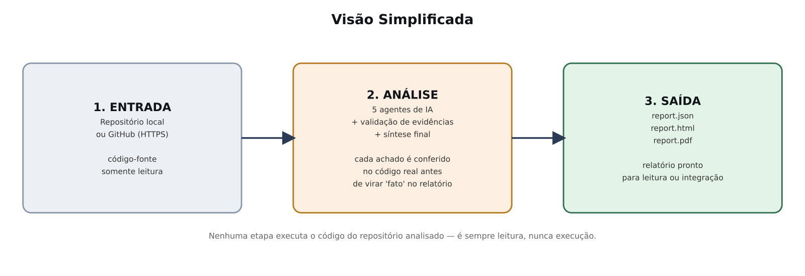
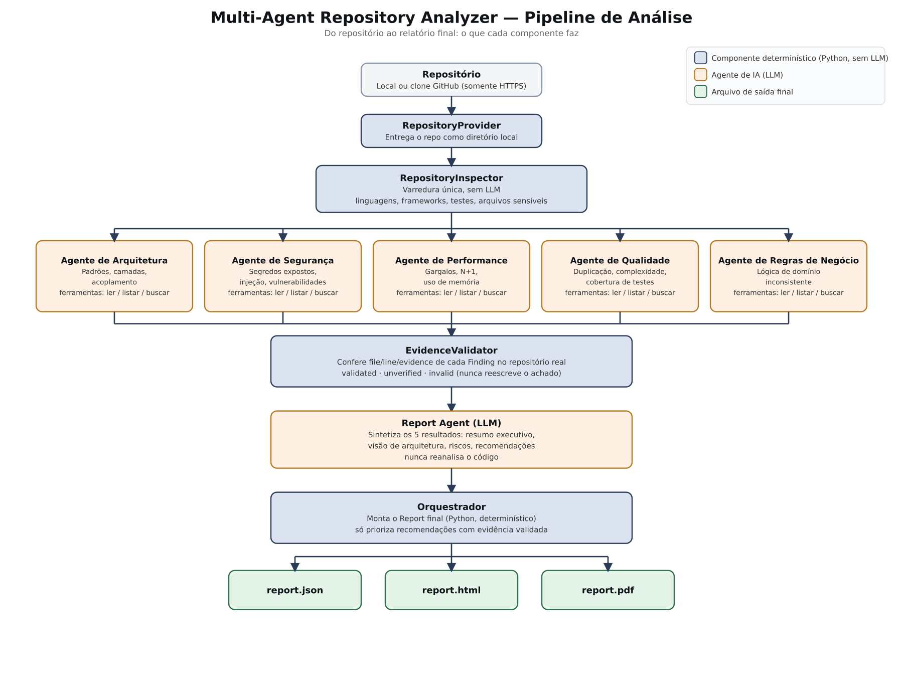
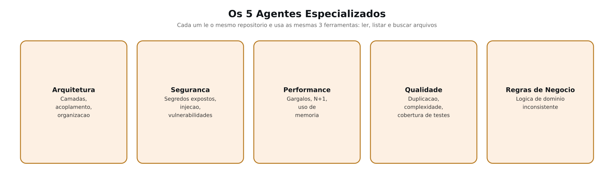
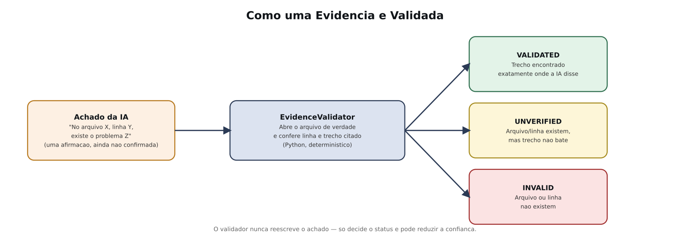

# Arquitetura do Multi-Agent Repository Analyzer

Como o pipeline funciona por dentro. Para a visão geral do produto, veja o [README](../README.md).

## Visão em 3 passos

Entrada (repositório) → Análise (5 agentes + validação) → Saída (JSON/HTML/PDF).

## Pipeline completo

Legenda de cores: cinza é entrada, azul é Python determinístico, laranja é agente de IA, verde é
arquivo de saída.

1. O `RepositoryProvider` entrega o repositório como um diretório local. Nem o inspector nem os
   agentes sabem de onde ele veio nem quais credenciais foram usadas para obtê-lo.
   - `LocalRepositoryProvider`: diretório já em disco, montado somente leitura.
   - `GitHubRepositoryProvider`: clone superficial (`depth=1`) num workspace temporário, removido ao
     final da análise, com sucesso ou falha. Só HTTPS é aceito; a autenticação via `GITHUB_TOKEN` é
     passada como variável de ambiente de curta duração ao subprocesso de clone.

2. O `RepositoryInspector` varre o repositório uma única vez, sem LLM, e monta o `RepositoryContext`
   que todos os agentes vão compartilhar: linguagens, frameworks, migrations, diretórios de
   models/controllers/routes/services/tests, Dockerfiles, arquivos de CI/CD e os caminhos (nunca o
   conteúdo) de arquivos sensíveis como `.env`, `*.pem`, `id_rsa*`.

3. Os 5 agentes especializados leem esse mesmo contexto:

   

   Architecture, Performance, Code Quality e Business Rules usam hoje o modo legacy: um agente CrewAI
   com tool-calling autônomo e 3 ferramentas somente-leitura (`read_repository_file`,
   `list_repository_files`, `search_repository`).

   Security tem dois modos, controlados por `SECURITY_ANALYSIS_MODE`. O padrão, `legacy`, é o mesmo
   modelo dos outros agentes. O modo `two_pass` troca o tool-calling autônomo por um pipeline em
   etapas fixas: Pass A planeja as queries de busca, um retrieval determinístico as executa (sem o
   agente decidindo sozinho o que buscar), a evidência recuperada vira registros estruturados, Pass C
   gera achados ancorados nesses registros, e por fim vem a localização de `file`/`line`/`evidence` e
   o `EvidenceValidator`. Se o two-pass falhar em algum ponto, não há fallback silencioso para o modo
   legacy.

   Code Quality tem um terceiro modo além de legacy: `hybrid` (detectores estruturais
   determinísticos combinados com o agente de LLM, o padrão) ou `structural` (só os detectores, sem
   LLM nenhuma).

4. O `EvidenceValidator` reconfere mecanicamente o `file`/`line`/`evidence` de cada achado contra o
   repositório real, marcando `validated`, `unverified` ou `invalid`, sem nunca reescrever o achado:

   

5. O Report Agent só sintetiza achados que já foram produzidos (resumo executivo, riscos,
   recomendações); ele não reanalisa o código. Só achados `validated` entram na síntese executiva.
   Os `unverified` aparecem à parte, em "Pontos para Investigação".

6. O `Report` final é montado deterministicamente em Python. Uma recomendação só vira "prioridade" se
   estiver ancorada em evidência `validated`.

## Saída

Cada execução grava `report.json`, `report.html` e `report.pdf` em `reports/<analysis_id>/`. O
`report.json` também guarda, por agente, `analysis_mode_by_agent` (`legacy`/`two_pass`) e
`two_pass_by_agent` com a telemetria de cada etapa: duração, outcome, contagem de achados.

## Reexecução parcial

`--report-only <report.json>` roda só o Report Agent a partir de achados já salvos. Serve para os
casos em que apenas a síntese falhou ou expirou, sem precisar pagar de novo pelas chamadas de LLM dos
5 agentes especializados.

## Benchmark

O analyzer pode ser comparado a uma referência parcial e curada, exportada de um scanner externo
(hoje, SonarQube num projeto real). Não é ground truth absoluto: a referência lista casos conhecidos
para medir recall, não o universo de todos os achados possíveis. Cada finding da referência carrega
uma adjudicação humana (`confirmed`, `contextual` ou `rejected`). O matching é determinístico:
domínio compatível, `file` exatamente igual, `line` dentro de uma tolerância, sem embeddings e sem
LLM-as-judge.

## Limitações conhecidas

- Só análise estática. Nenhuma execução do código do repositório analisado.
- A confiabilidade da saída depende da LLM usada; modelos locais menores às vezes falham em produzir
  saída interpretável ou não usam as tools de forma confiável em tarefas mais complexas.
- Detecção de framework e linguagem é heurística (convenções de nome de arquivo/caminho), não um
  parser completo.
- Os 5 agentes ainda rodam sequencialmente, mas o código já é orientado a dados o suficiente para
  migrar para execução concorrente sem mexer na assinatura de chamada de nenhum agente.
- `REPORT_LANGUAGE` traduz só os rótulos fixos do template. O conteúdo gerado pela LLM sai no idioma
  em que o modelo decidir responder.
